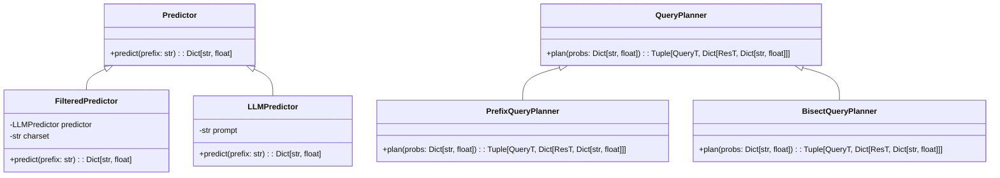

# Bllind

LLM などの次トークン予測器を用いて、Blind SQL Injection などの Oracle-Based Attack を高速化するツール。

## 思想

先頭から文字列を 1 文字ずつ特定していく、Blind SQL Injection 系の攻撃について考える。

ここで、LLM などの次の文字を予測する技術によって投げるクエリを効率的にすることができる。

これを行う Python ライブラリを作りたい。

Python ライブラリでは、以下の様なコードがかければ理想である。

```py
def oracle(prefix: str):
  print(f'[+] {python_code=}')
  start = time.time()
  requests.post("/oracle", data={"code": f"sleep(1 if (flag.startswith({repr(prefix)})) else 0)"})
  return 1 <= time.time() - start

do_blind_attack(
  oracle,
  predictor=FilteredPredictor(
  	LLMPredictor(prompt="Following is a flag string from the ctf challenge: {prefix}"),
  	charset=string.printable[:-5]
  ),
  queryplanner=PrefixQueryPlanner(),
  known_prefix="FLAG{",
  known_suffix="}"
)
```

ここで、predictor は次の文字の確率分布を返す。また、queryplanner は確率分布からクエリと、クエリの結果ごとの事後確率を返せば良い。

```py
class QueryPlanner:
  def plan(self, probs: Dict[str, float]) -> Tuple[QueryT, Dict[ResT, Dict[str, float]]]:
    ...
```

## 設計

このライブラリは、以下のクラスを含みます：

### Predictor（基底クラス）

次の文字の確率分布を返すクラス。

```python
class Predictor:
    def predict(self, prefix: str) -> Dict[str, float]:
        pass
```

### FilteredPredictor（派生クラス）

LLMPredictor を使用し、特定の文字セットにフィルタリングされた予測を返すクラス。

```python
class FilteredPredictor(Predictor):
    def __init__(self, predictor: LLMPredictor, charset: str):
        self.predictor = predictor
        self.charset = charset

    def predict(self, prefix: str) -> Dict[str, float]:
        pass
```

### LLMPredictor（派生クラス）

LLM を使用して次の文字を予測するクラス。

```python
class LLMPredictor(Predictor):
    def __init__(self, prompt: str):
        self.prompt = prompt

    def predict(self, prefix: str) -> Dict[str, float]:
        pass
```

### QueryPlanner（基底クラス）

クエリと事後確率を計画するクラス。

```python
class QueryPlanner:
    def plan(self, probs: Dict[str, float]) -> Tuple[QueryT, Dict[ResT, Dict[str, float]]]:
        pass
```

### PrefixQueryPlanner（派生クラス）

プレフィックスに基づいてクエリを計画するクラス。

```python
class PrefixQueryPlanner(QueryPlanner):
    def plan(self, probs: Dict[str, float]) -> Tuple[QueryT, Dict[ResT, Dict[str, float]]]:
        pass
```

### BisectQueryPlanner（派生クラス）

二分探索に基づいてクエリを計画するクラス。

```python
class BisectQueryPlanner(QueryPlanner):
    def plan(self, probs: Dict[str, float]) -> Tuple[QueryT, Dict[ResT, Dict[str, float]]]:
        pass
```

## クラス図


